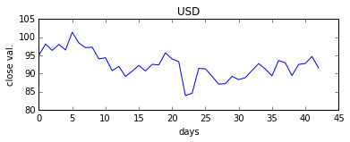
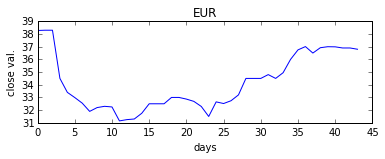
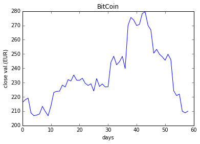

## USD vs EUR

    %matplotlib inline
    
    from datetime import datetime, timedelta
    from pandas.io.data import DataReader
    from pandas.io.parsers import read_csv
    
    FIN_SERVICE_PROVIDER = 'yahoo'
    PAST_DAYS = 60
    
    # SYMBOL = ['IBM', 'AAPL']
    SYMBOL = ['USD', 'EUR']
    
    # today
    t1 = datetime.now()
    # two months later
    t2 = t1 - timedelta(days=PAST_DAYS)
    
    df1  = DataReader(SYMBOL[0],  FIN_SERVICE_PROVIDER , t2, t1)
    df2  = DataReader(SYMBOL[1],  FIN_SERVICE_PROVIDER , t2, t1)

### USD

    df1.tail()

<table border="1" class="dataframe">
  <thead>
    <tr style="text-align: right;">
      <th></th>
      <th>Open</th>
      <th>High</th>
      <th>Low</th>
      <th>Close</th>
      <th>Volume</th>
      <th>Adj Close</th>
    </tr>
    <tr>
      <th>Date</th>
      <th></th>
      <th></th>
      <th></th>
      <th></th>
      <th></th>
      <th></th>
    </tr>
  </thead>
  <tbody>
    <tr>
      <th>2015-04-17</th>
      <td>91.41</td>
      <td>92.20</td>
      <td>89.42</td>
      <td>89.42</td>
      <td>5700</td>
      <td>89.42</td>
    </tr>
    <tr>
      <th>2015-04-20</th>
      <td>89.99</td>
      <td>92.74</td>
      <td>89.99</td>
      <td>92.48</td>
      <td>5500</td>
      <td>92.48</td>
    </tr>
    <tr>
      <th>2015-04-21</th>
      <td>92.74</td>
      <td>93.32</td>
      <td>92.43</td>
      <td>92.74</td>
      <td>1900</td>
      <td>92.74</td>
    </tr>
    <tr>
      <th>2015-04-22</th>
      <td>93.57</td>
      <td>94.68</td>
      <td>93.24</td>
      <td>94.68</td>
      <td>2200</td>
      <td>94.68</td>
    </tr>
    <tr>
      <th>2015-04-23</th>
      <td>90.25</td>
      <td>91.84</td>
      <td>89.95</td>
      <td>91.50</td>
      <td>1600</td>
      <td>91.50</td>
    </tr>
  </tbody>
</table>

### EUR

    df2.tail()

<table border="1" class="dataframe">
  <thead>
    <tr style="text-align: right;">
      <th></th>
      <th>Open</th>
      <th>High</th>
      <th>Low</th>
      <th>Close</th>
      <th>Volume</th>
      <th>Adj Close</th>
    </tr>
    <tr>
      <th>Date</th>
      <th></th>
      <th></th>
      <th></th>
      <th></th>
      <th></th>
      <th></th>
    </tr>
  </thead>
  <tbody>
    <tr>
      <th>2015-04-17</th>
      <td>36.81</td>
      <td>37.25</td>
      <td>36.22</td>
      <td>37.00</td>
      <td>1071000</td>
      <td>36.21</td>
    </tr>
    <tr>
      <th>2015-04-20</th>
      <td>37.00</td>
      <td>37.14</td>
      <td>36.55</td>
      <td>36.99</td>
      <td>279600</td>
      <td>36.20</td>
    </tr>
    <tr>
      <th>2015-04-21</th>
      <td>37.20</td>
      <td>37.47</td>
      <td>36.55</td>
      <td>36.90</td>
      <td>379700</td>
      <td>36.11</td>
    </tr>
    <tr>
      <th>2015-04-22</th>
      <td>36.80</td>
      <td>37.70</td>
      <td>36.62</td>
      <td>36.90</td>
      <td>374300</td>
      <td>36.11</td>
    </tr>
    <tr>
      <th>2015-04-23</th>
      <td>36.89</td>
      <td>37.05</td>
      <td>36.61</td>
      <td>36.80</td>
      <td>302800</td>
      <td>36.01</td>
    </tr>
  </tbody>
</table>

    plt.figure(1)
    plt.subplot(211)
    plt.title(SYMBOL[0])
    plt.xlabel('days')
    plt.ylabel('close val.')
    plot(df1['Close'])
    
    plt.figure(2)
    plt.subplot(211)
    plt.title(SYMBOL[1])
    plt.xlabel('days')
    plt.ylabel('close val.')
    plot(df2['Close'])

    [<matplotlib.lines.Line2D at 0x10d7c2090>]

## Bitcoin History vs EUR

    # BIT_COIN_CSV_URL = 'http://www.quandl.com/api/v1/datasets/BCHARTS/BITSTAMPUSD.csv'
    BIT_COIN_CSV_URL = 'http://www.quandl.com/api/v1/datasets/BCHARTS/KRAKENEUR.csv'
    
    bcdf = read_csv(BIT_COIN_CSV_URL)
    bcdf = bcdf[bcdf['Date']> t2.strftime("%Y-%m-%d")]
    bcdf.head()

<table border="1" class="dataframe">
  <thead>
    <tr style="text-align: right;">
      <th></th>
      <th>Date</th>
      <th>Open</th>
      <th>High</th>
      <th>Low</th>
      <th>Close</th>
      <th>Volume (BTC)</th>
      <th>Volume (Currency)</th>
      <th>Weighted Price</th>
    </tr>
  </thead>
  <tbody>
    <tr>
      <th>0</th>
      <td>2015-04-23</td>
      <td>217.96000</td>
      <td>219.53726</td>
      <td>213.69732</td>
      <td>216.07424</td>
      <td>2565.565405</td>
      <td>556321.222937</td>
      <td>216.841567</td>
    </tr>
    <tr>
      <th>1</th>
      <td>2015-04-22</td>
      <td>219.18000</td>
      <td>220.99990</td>
      <td>215.79000</td>
      <td>218.00000</td>
      <td>2966.605362</td>
      <td>647436.879653</td>
      <td>218.241660</td>
    </tr>
    <tr>
      <th>2</th>
      <td>2015-04-21</td>
      <td>208.73600</td>
      <td>220.00000</td>
      <td>208.39000</td>
      <td>219.14000</td>
      <td>3348.357437</td>
      <td>708749.197792</td>
      <td>211.670711</td>
    </tr>
    <tr>
      <th>3</th>
      <td>2015-04-20</td>
      <td>206.92460</td>
      <td>211.45871</td>
      <td>206.30000</td>
      <td>208.73084</td>
      <td>2875.411730</td>
      <td>602077.962728</td>
      <td>209.388435</td>
    </tr>
    <tr>
      <th>4</th>
      <td>2015-04-19</td>
      <td>207.83591</td>
      <td>211.25000</td>
      <td>206.47580</td>
      <td>206.85460</td>
      <td>792.255962</td>
      <td>165759.762088</td>
      <td>209.225011</td>
    </tr>
  </tbody>
</table>

    plt.title("BitCoin")
    plt.xlabel('days')
    plt.ylabel('close val.(EUR)')
    plot(bcdf['Close'])

    [<matplotlib.lines.Line2D at 0x10b932650>]

### Close Price Statistics

#### Mean (in 60 Days)

    bcdf['Close'].mean()

    234.97629711864406

#### Variance (in 60 days)

    bcdf['Close'].var()

    424.8130569661775

    
